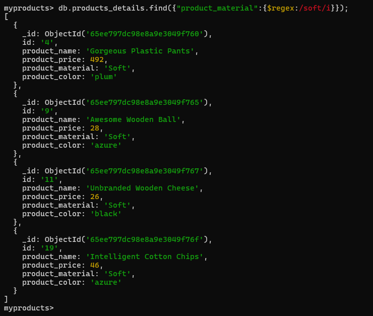

1. Find all the information about each products. Query `db.products_details.find();`.

2. Find the product price which are between 400 to 800. Query ` db.products_details.find({'product_price':{'$gte':400,'$lte':800}});`.

3. Find the product price which are not between 400 to 600. Query `db.products_details.find({'product_price':{'$not':{'$gte':400,'$lte':600}}});`.

4. List the four product which are greater than 500 in price. Query `db.products_details.find({'product_price':{'$gte':500}});`.

5. Find the product name and product material of each products. Query ` db.products_details.find({}, {_id: 0, product_name: 1, product_material: 1});`.

6. Find the product with a row id of 10. Query `db.products_details.find({'id':'10'});`.

7. Find only the product name and product material. Query `db.products_details.find({}, {_id: 0, product_name: 1, product_material: 1});`

8. Find all products which contain the value of soft in product material. Query `db.products_details.find({"product_material":{$regex:/soft/i}});`.

9. Find products which contain product color indigo  and product price 492.00. Query `db.products_details.find({$or:[{"product_color":"indigo"},{"product_price":492}]});`.

10. Delete the products which product price value are same. Query ` db.products_details.aggregate([{$group:{_id:"$product_price",count:{$count:{}}}},{$match:{_id:{$ne:null},count:{$gt:1}}}]);` and output is `[ { _id: 47, count: 2 }, { _id: 36, count: 2 } ]`, Again we run the query `db.products_details.deleteMany({ product_price: { $in: [36, 47] } });`.

